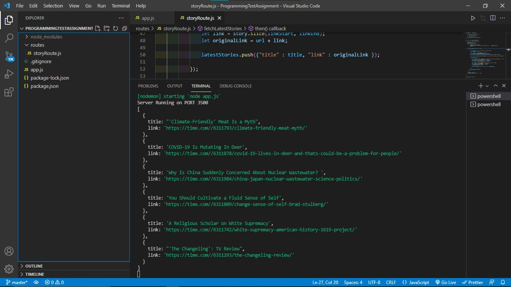
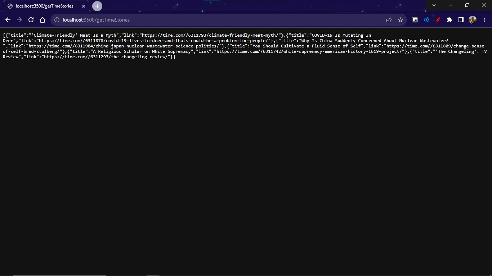

## INSTRUCTIONS

I Will call the service like this, assuming the URL to the service is
http://localhost/getTimeStories this is a simple GET call. In response I Want This,
this is a JSON object array with the latest 6 stories, by parsing the page.

## Output:

